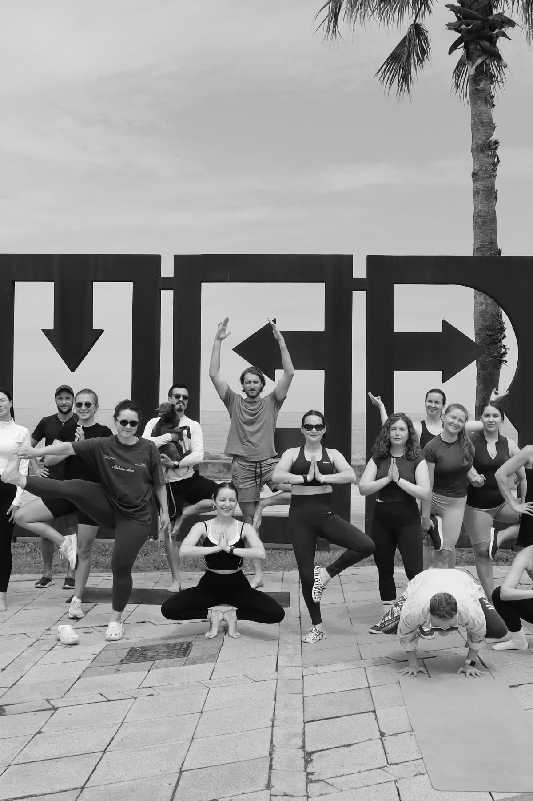

# Bakasana

**A mobile yoga practice companion for iPhone and Android, built to help people practice consistently, track progress, and see their transformation over time.**

<p align="center">
  
</p>

> **Current status:** Publicly available on the App Store and Google Play

[Visit the website](https://bakasana.app/) · [About](https://bakasana.app/about/) · [Follow on Instagram](https://www.instagram.com/bakasana.app/) · [Download on the App Store](https://apps.apple.com/app/bakasana/id6776696295) · [Get it on Google Play](https://play.google.com/store/apps/details?id=com.bakasana.bakasana_app) · [Beta testing access](#beta-testing-access) · [Contact support](mailto:bakasana.app@gmail.com)

Русская версия сайта: [bakasana.app/ru/](https://bakasana.app/ru/)

## About Bakasana

Bakasana helps you practice yoga regularly with guided sessions, progress tracking, streaks, a private Practice Timeline, sharing, and leaderboards. It is a practice companion—not a web trainer, not a sequence builder, and not an app for a single pose.

Brand line: *Build a yoga practice you want to return to.*

Closing line (all surfaces): *Find your balance. Return to practice.*

Shared product and expert copy lives in [`_data/brand.yml`](_data/brand.yml).

The app supports four complementary ways to practice:

| Program | Focus | Experience |
| --- | --- | --- |
| **Bakasana** | Balance and concentration | Build the stability and confidence needed for crane pose. |
| **Plank** | Strength and endurance | Develop the full-body foundation behind a stronger practice. |
| **Shavasana** | Recovery and meditation | Follow guided voice sessions and make space for deliberate rest. |
| **Flow** | Free-form movement | Practice through your own sequence while Bakasana quietly records your timeline. |

## What the app includes

- Guided setup, countdown, live practice, results, and practice-again flows.
- Daily totals, practice history, streaks, and per-program progress.
- Game Center and Play Games sign-in, cloud progress, and leaderboards.
- Share cards for sessions, rankings, and longer-term progress.
- Optional practice reminders in English and Russian.
- **Practice Timeline:** short, silent clips assembled into a personal timelapse (on device; never uploaded by Bakasana).
- Guest Mode without a separate Bakasana account.

## Privacy by design

Practice Timeline camera access is optional. Captured clips and generated videos are processed and stored on the device; Bakasana does not upload this media to its servers. Users can review or delete individual clips, remove timeline data, or disable the feature.

Read the full [Privacy Policy](https://bakasana.app/privacy/) and [account deletion instructions](https://bakasana.app/delete-account/).

## Availability

| Platform | Status | Access |
| --- | --- | --- |
| iPhone | Public release | [Download on the App Store](https://apps.apple.com/app/bakasana/id6776696295) |
| Android | Public release | [Get it on Google Play](https://play.google.com/store/apps/details?id=com.bakasana.bakasana_app) |

The current website reflects public app version **2.2.6, build 44**.

## Beta testing access

The public App Store and Google Play releases are the default downloads. Existing testers—and users who want to join an available testing track—can continue with these links:

| Platform | Testing channel | Access |
| --- | --- | --- |
| iPhone | Apple TestFlight | [Join the iOS beta](https://testflight.apple.com/join/r7A2STTS) |
| Android | Google Play testing | [Open the testing listing on Android](https://play.google.com/store/apps/details?id=com.bakasana.bakasana_app) or [join on the web](https://play.google.com/apps/testing/com.bakasana.bakasana_app) |

Testing-track availability and beta versions are managed through TestFlight and Google Play and may differ from the public release.

## This repository

This repository contains the public Bakasana promotional, support, privacy, and legal website. It is a lightweight Jekyll site deployed through GitHub Pages (English primary + Russian under `/ru/`).

```text
BKSN/
├── .github/workflows/     GitHub Actions deploy (Jekyll 4 → Pages)
├── _data/                 Shared brand and bilingual UI copy
├── _includes/             Homepage and About JSON-LD schemas
├── _layouts/              Shared page layout
├── about/                 About Bakasana + Alena Tkacheva
├── ru/                    Russian homepage and About page
├── assets/                Styles, images, video, and download QR code
├── delete-account/        Account and data deletion instructions
├── download/              Platform-aware store redirect
├── privacy/               Privacy Policy
├── support/               Product support
├── terms/                 Terms of Service
├── Gemfile                Jekyll 4.4.1 dependencies
├── robots.txt             Crawler policy (GPTBot and OAI-SearchBot allowed)
├── sitemap.xml            Production routes with EN/RU hreflang pairs
├── index.html             Product landing
└── _config.yml            Jekyll configuration
```

### Run locally

Requires Ruby 3.2+ and Bundler. Install gems once, then serve:

```bash
bundle install
bundle exec jekyll serve --host 127.0.0.1 --port 4000
```

Open [http://127.0.0.1:4000/](http://127.0.0.1:4000/). Jekyll automatically rebuilds the site when source files change.

The site is built with **Jekyll 4.4.1** both locally and on GitHub Actions (GitHub Pages legacy builder is pinned to Jekyll 3.10 and is not used).

### Production build

```bash
JEKYLL_ENV=production bundle exec jekyll build
```

Generated output is written to `_site/`. The configured production site is [https://bakasana.app/](https://bakasana.app/).

## Support and legal

- [Support](mailto:bakasana.app@gmail.com)
- [Support center](https://bakasana.app/support/)
- [Instagram](https://www.instagram.com/bakasana.app/)
- [Privacy Policy](https://bakasana.app/privacy/)
- [Terms of Service](https://bakasana.app/terms/)
- [Delete account and data](https://bakasana.app/delete-account/)

For product feedback, beta feedback, or account assistance, email **bakasana.app@gmail.com**.
