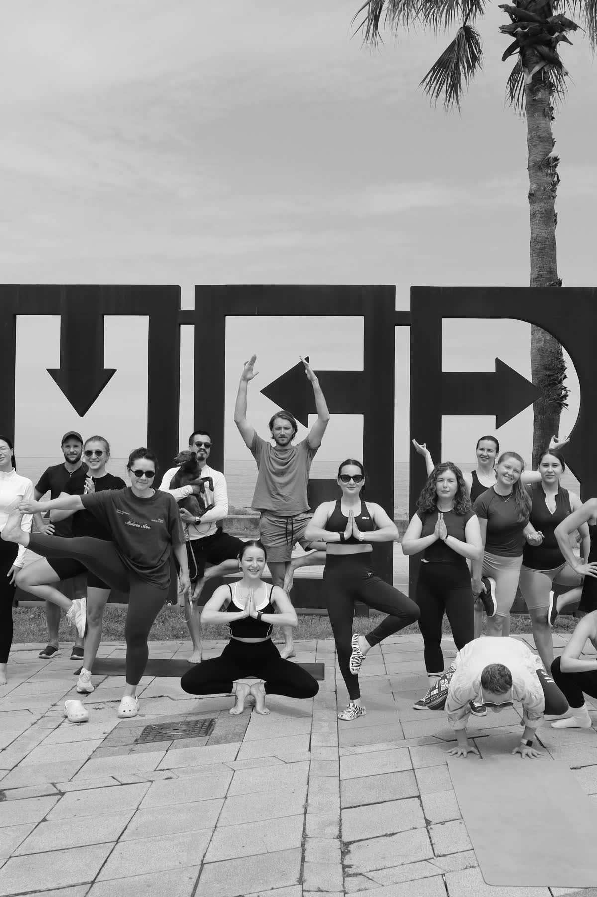

# Bakasana

**The social app for a yoga practice you want to return to, on iPhone and Android.**

> **Current status:** Publicly available on the App Store and Google Play

[Visit the website](https://bakasana.app/) · [About](https://bakasana.app/about/) · [Follow on Instagram](https://www.instagram.com/bakasana.app/) · [Download on the App Store](https://apps.apple.com/app/bakasana/id6776696295) · [Get it on Google Play](https://play.google.com/store/apps/details?id=com.bakasana.bakasana_app) · [Beta testing access](#beta-testing-access) · [Contact support](mailto:bakasana.app@gmail.com)

Русская версия сайта: [bakasana.app/ru/](https://bakasana.app/ru/)

## About Bakasana

Bakasana helps you log every practice, join challenges, compete with friends, and climb the leaderboard.

Brand line: *Build a yoga practice you want to return to.*

Closing line (all surfaces): *Find your balance. Keep going.*

Shared product and expert copy lives in `[_data/brand.yml](_data/brand.yml)`.

The app supports five paths, plus Free Training:

| Program           | Focus                     | Experience                                                                       |
| ----------------- | ------------------------- | -------------------------------------------------------------------------------- |
| **Bakasana**      | Balance and concentration | Train balance, focus, and confidence toward crow pose.                           |
| **Plank**         | Strength and endurance    | Develop the full-body foundation behind a stronger practice.                     |
| **Down Dog**      | Hold                      | Lengthen the spine, build shoulder strength, and hold a steady inverted V.       |
| **Flow**          | Free-form movement        | Practice through your own session with optional clip capture.                    |
| **Shavasana**     | Recovery and meditation   | Follow guided voice sessions and make rest part of regular practice.             |
| **Free Training** | Any other session         | Log pilates, calisthenics, boxing, cycling, or anything else so it still counts. |

